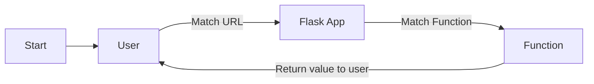
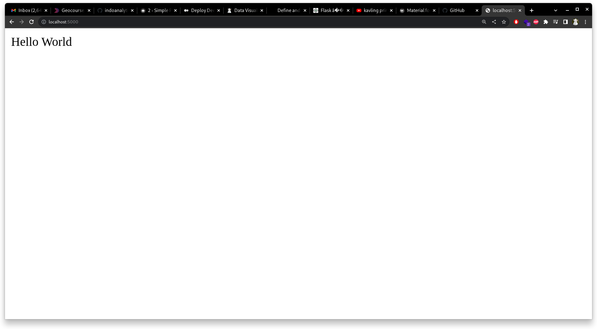

# Installation and Quick Start

First you need to install Flask into your project using pip command.

1. create new folder for your project, for example `portfolio`.
2. run command `pip install Flask`.
3. create file `main.py` inside your folder.


```

portfolio/      # Our project name
    - main.py   # Flask app

```

## Quickstart
open your `main.py` file and we gonna create our first Flask app.

``` python
# portfolio/main.py

from flask import Flask
app = Flask(__name__)

@app.route('/')
def hello_world():
   return 'Hello World'

if __name__ == '__main__':
   app.run()

```

## Explanation
So the diagram proces of our simple code is like this



So what did that code do?

1. First, import `Flask` library to our `main.py` file.
2. Create instance of this `Flask` and we give `app` as name.
3. Then we make our first route. Route is use for mapping our url to logic and function. For example, if we have website `www.example.com/` so the route of our application gonna be `@app.route('/')`. And if we want to provide information to our website at `www.example.com/about` so the code is `@app.route('/about')`
4. Next, we define function that have logic and provide information that we want. For example we gonna put information at `www.example.com/`
5. At last line is syntax for running our project.


## Running our project 
for running our project type `python main.py`. And by default our application running on `localhost:5000`.

