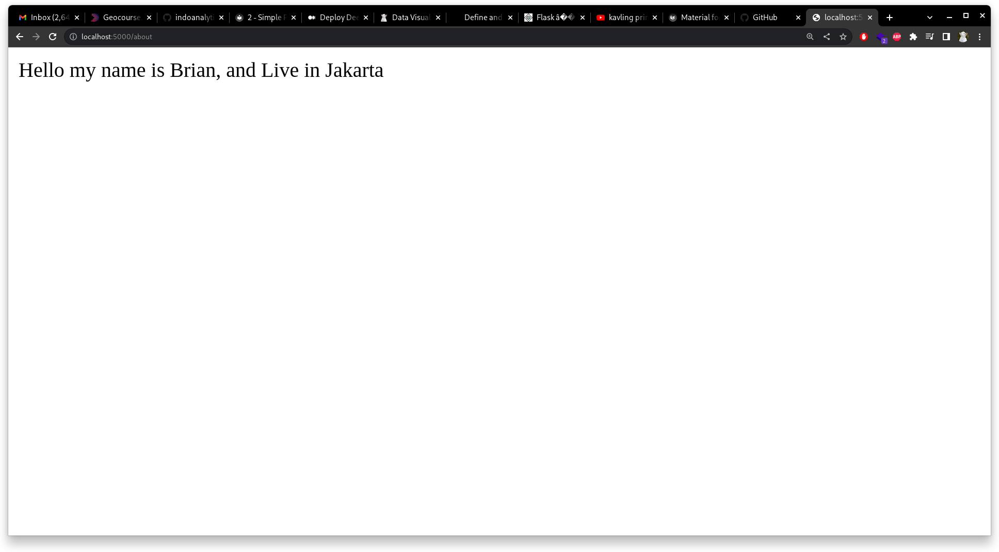

# Minimal Application

From previous example our application is running. Next, we try to add more functionality to our app. We will add `/about` that provide information. So we add more route to our application using `@app.route('about')`.


``` python
# portfolio/main.py

...

@app.route('/')
def hello_world():
   return 'Hello World’

@app.route('/about')
def about_page():
    return 'Hello my name is Brian, and Live in Jakarta'

...


```

Now our application have 2 endpoint at `/` and `/about`. Now running our application using `python main.py` and then open `localhost:8000/about`

