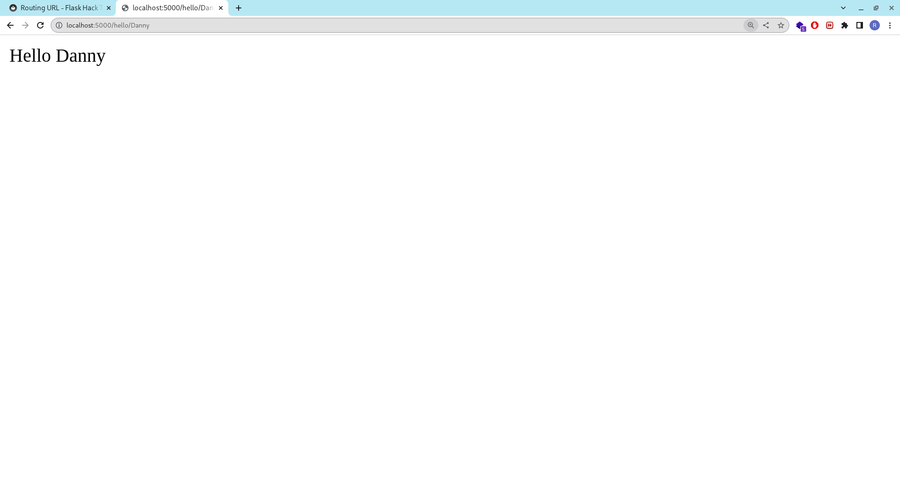
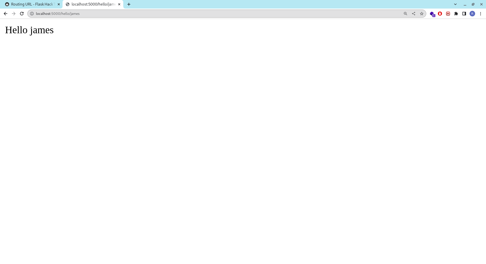

# Routing URL

Now our application have 2 endpoint route `/` and `/about`. It is possible to build url dynamically bny adding variabel and parameter. Now let's create new dynamic route that have variabel name.

``` python
# portfolio/main.py

...

@app.route('/hello/<name>')
def hello_name(name):
    return f'Hello {name}'

...

```

run our application and open `localhost:5000/hello/Danny`



variable `Danny` at url is dynamic. You can pass variabel that you want. Now, lets try `localhost:5000/hello/james`



for dynamic url you can specify the type of your variable.

| types | description |
| :--- | :--- |
| string | (default) accepts any text without a slash |
| int | accepts positive integers |
| float | accepts positive floating point values |
| path | like string but also accepts slashes |
| uuid | accepts UUID strings |