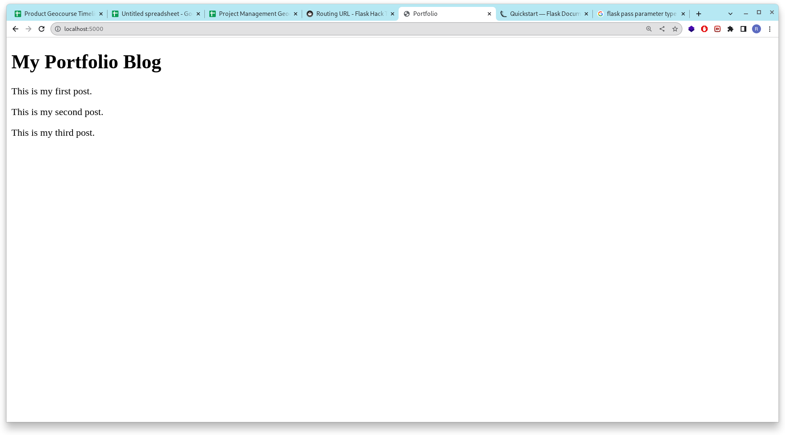

# Tempalate and HTML

## HTML Template 

So far we can acces our application running on `localhost:5000` and return views to the user. Instead return text into user we're gonna return HTML (the proper way).


```

portfolio/          # Our project name
    - main.py       # Flask app
    - templates/    # Templates folder
        - home.html

```

create folder `templates` inside your project and create new file `home.html`. For home page we're gonna user our `home.html` 

``` html

<!-- portfolio/templates/home.html -->

<!DOCTYPE html>
<html>
    <head>
        <title>Portfolio</title>
    </head>
    <body>
        <h1>My Portfolio Blog</h1>
        <p>This is my first post.</p>
        <p>This is my second post.</p>
        <p>This is my third post.</p>

    </body>
</html>

```

and now let's change our views at route `/`. Automaticcaly flask search our template inside `templates` folder

``` python

...

@app.route('/')
def hello_world():
   return render_template('home.html')

   ...

```

restart our application and running again. Then acces `localhost:5000/` and you gonna see our homepage change.

